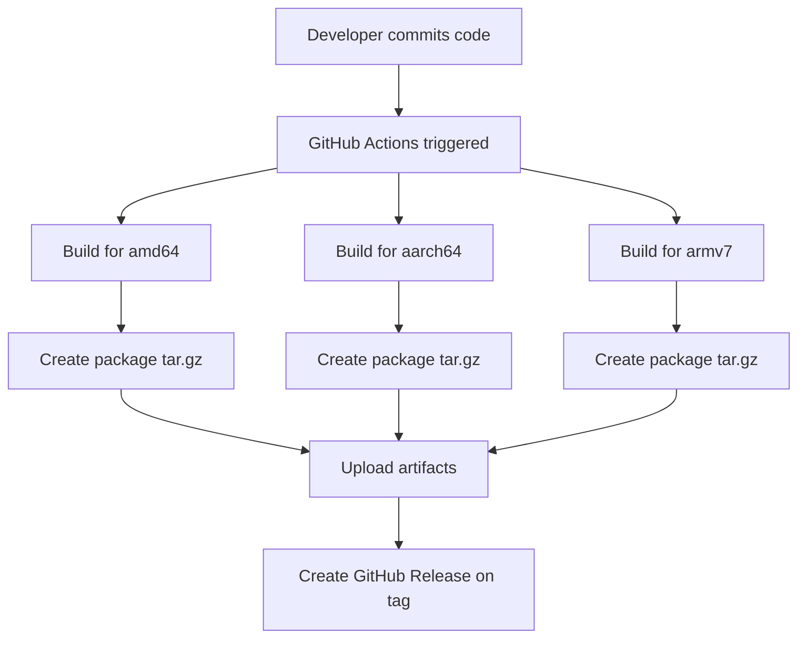
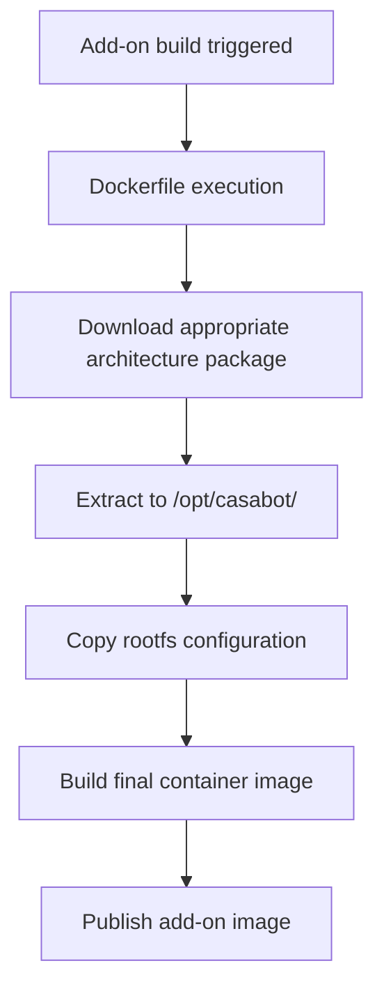

# CasaBot Build Process Documentation

This document describes the new separated build architecture for CasaBot and the Home Assistant add-on.

## Overview

The CasaBot project has been restructured into two separate repositories:

1. **casabot** - Contains the application source code and builds packages
2. **addon-casabot** - Contains the Home Assistant add-on configuration and consumes pre-built packages

## Repository Structure

### CasaBot Repository (jmservera/casabot)

This repository contains the .NET Blazor Server application source code and is responsible for:

- Building the CasaBot application for multiple architectures
- Creating distribution packages (tar.gz files)
- Publishing releases with versioned packages
- Managing application-specific documentation and changelog

**Key Files:**

- `src/` - .NET Blazor application source code
- `.github/workflows/build.yml` - Multi-architecture build pipeline
- `README.md` - Application documentation
- `CHANGELOG.md` - Application version history

### Add-on Repository (jmservera/addon-casabot)

This repository contains the Home Assistant add-on configuration and is responsible for:

- Home Assistant add-on metadata and configuration
- Docker container setup and service configuration
- Downloading and integrating pre-built CasaBot packages
- Add-on specific documentation

**Key Files:**

- `casabot/config.yaml` - Home Assistant add-on configuration
- `casabot/Dockerfile` - Downloads pre-built packages instead of building from source
- `casabot/rootfs/` - Container configuration files (nginx, s6-overlay)
- `.github/workflows/ci.yaml` - Add-on build and publish pipeline

## Build Process Flow

### 1. Application Development (casabot repository)



### 2. Add-on Build (addon-casabot repository)



## Package Management

### Versioning Strategy

- **CasaBot Application**: Uses semantic versioning (v1.0.0, v1.1.0, etc.)
- **Add-on**: Independent versioning that can reference specific CasaBot versions

### Package Download

The add-on Dockerfile includes logic to download packages from GitHub Releases:

```dockerfile
ARG CASABOT_VERSION="0.1.0"
ARG CASABOT_REPO="jmservera/casabot"

RUN \
    # Download logic based on architecture
    DOWNLOAD_URL="https://github.com/${CASABOT_REPO}/releases/download/v${CASABOT_VERSION}/${ASSET_NAME}" && \
    curl -L "${DOWNLOAD_URL}" | tar -xz -C /opt/casabot
```

### Architecture Support

Both repositories support the same three architectures:

- **amd64** (x86_64) - Intel/AMD 64-bit
- **aarch64** (ARM64) - ARM 64-bit
- **armv7** (ARM32) - ARM 32-bit

## Development Workflow

### For Application Changes

1. Work in the `casabot` repository
2. Test locally with `dotnet run`
3. Commit and push changes
4. Create git tag for release (triggers package build)
5. Verify packages are published to GitHub Releases

### For Add-on Changes

1. Work in the `addon-casabot` repository
2. Update `CASABOT_VERSION` in Dockerfile if needed
3. Test add-on build locally or in PR
4. Update add-on version in `config.yaml`
5. Merge and release add-on update

### Version Updates

To update the CasaBot version used by the add-on:

1. Edit `casabot/Dockerfile`
2. Change the `CASABOT_VERSION` ARG to desired version
3. Test the build
4. Update add-on version and release

## Benefits of This Architecture

### Development Benefits

- **Separation of Concerns**: App developers can work independently from add-on maintainers
- **Faster Iteration**: Application changes don't require full add-on rebuild
- **Better Testing**: Dedicated CI/CD pipelines for each component
- **Independent Versioning**: Applications and add-ons can be versioned separately

### Build Benefits

- **Faster Add-on Builds**: No compilation during Docker build, just download and extract
- **Better Caching**: Pre-built packages can be cached and reused
- **Reduced Complexity**: Add-on build focuses on integration, not compilation
- **Multi-arch Consistency**: Same packages used across all architectures

### Maintenance Benefits

- **Clear Responsibility**: Issues can be routed to appropriate repository
- **Easier Debugging**: Application vs add-on issues are clearly separated
- **Version Tracking**: Easy to see which application version is in each add-on release
- **Rollback Capability**: Easy to revert to previous application versions

## Migration from Previous Architecture

The previous monolithic approach built everything in a single repository. The migration involved:

1. **Extracting Source Code**: Moved `casabot/src/` to separate repository
2. **Creating Build Pipeline**: Added GitHub Actions for multi-arch builds
3. **Updating Dockerfile**: Changed from compilation to package download
4. **Documentation Updates**: Updated READMEs and added this process documentation

This separation provides a more maintainable and scalable architecture for the CasaBot ecosystem.
